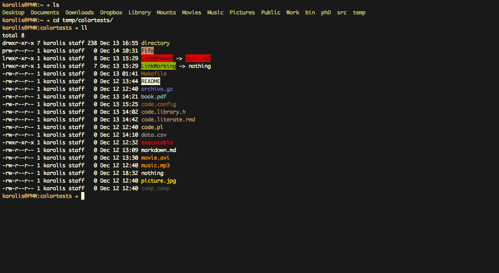
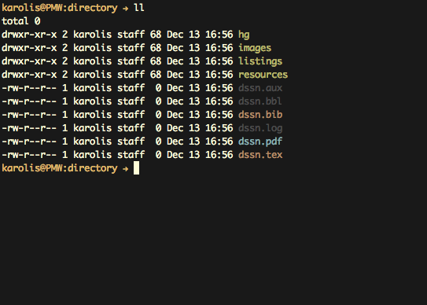
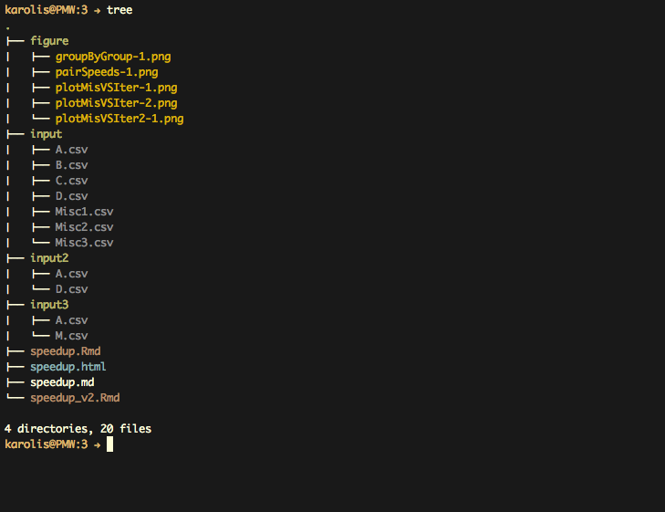
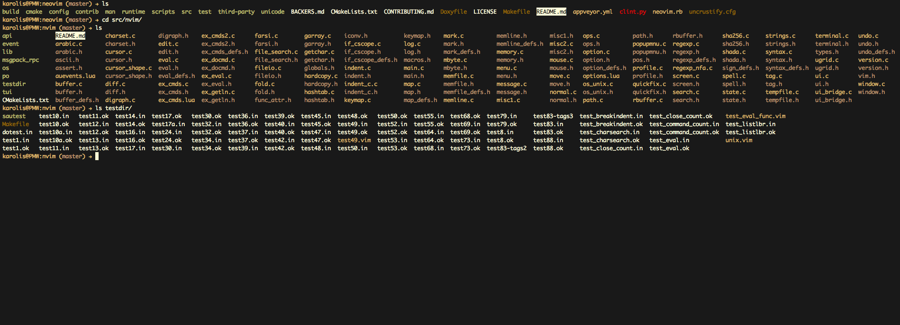

# 256 Color Theme "Moonshine" for GNU ls #

This is a 256-color *dircolors* colorscheme for GNU ls.

It is heavily based on and inspired by
**[dircolors-solarized](https://github.com/seebi/dircolors-solarized)**
a similar colorscheme by **Sebastian Tramp**. Please visit the original theme
for both better documentation and alternative (original) version.

## Colors ##

Here is a sample screenshot displaying the all of the used colors.

Explanation for all the choices:

* **Directories** are **dark green**. This color is easy on the eyes and works
well for majority of cases when working in terminal, like writing code.
Admittedly they won't stand out among lots of other files. For this reason
I recommend using this *ls* alias:

`alias ls='ls --group-directories-first --color=auto'`

So they are always at the front of ls output.

* **Working Links** are **light green inversed**. They are special enough to
justify being bright. And the green color shows the link is not broken.

* **Broken Links** are **red inversed**. Same as for Working links, except the
red color indicates that the link is broken and special attention is needed.

* **Broken Links** are **red inversed**. Same as for Working links, except the
red color indicates that the link is broken and special attention is needed.

* **Executable Files** are **red**. They are important, executable, with a
potential to change something. Red to notice.

* **Video Files** are **orange**. This is simply to stand out. Orange felt like
a great color for media.

* **Audio Files** are **orange**. Same as video. If you need to differentiate
between audio and video consider changing the shade of orange or adding bold
(like in Solarized)

* **Image Files** are **yellow**. They have similar nation to other *media*
files but are more light weight and more frequent. So a lighter tone of
"orange" (yellow) was chosen for them.

* **Document Files** are **light blue**. These are mainly readable files
(like pdf, doc, html). White (color of paper) is often associated with documents
but white was left for plain text. Light blue looked like close enough to white.
*html* inclusion in this category can be debated. Personally I never work with
html files as code files. Web developers are better of moving html to code
categories.

* **Plain Text** are **white**. This color is also chosen for all non-specified
files. The reason for this choice is that from my experience the files with
unspecified extensions are typically plain text files as well.

* **Archive Files** are **violet**. This is an unusual color. Again mainly to
stand out.

* **Special Interest Files** are **white inversed**. This is reserved for files
that should be noticed and read like READMEs, TOTOs, NOTEs.

* **Storange Files** are **light grey**. This includes outputs from various
programs and files that can be used as inputs. Mainly files for storing all
kids of data. Examples are *csv*, *xls*, *sav*.

* **Temporary Files** are **dark grey**. These are mainly the files that are
produced as a side effect and are not the final output of a process. Examples
are *log*, *tmp*, *cache*.

* **Usual Code Files** are **light brown**. These are source files of various
programming languages.

* **Library/Literal Code Files** are **brown**. Both library source files
and files that produce documents (like tex, rmd). The color was chosen to
distinguish them from usual source files when they are in the same category but
also make it easy enough to quickly group them as "code" when they are scattered
among various kinds of other files.

* **Special Code Files** are **dark brown**. This class contains configuration
files that do nothing on their own but are there to set parameters. Makefiles
are in this category.

## Changing Colors And Filetype Classes ##

The colors were selected for my personal use, they might need some changing in
order to better suite the needs of others.

### Changing Filetypes ###

One such example is the color of *html* files. For me they are always a simple
readable document and were included among other documents like pdf.If someone
is writing html they might be better of moving html to *Usual Code* or
*Literal Code* class. To achieve this - delete *html* filetype from *Documents*
category and add it to *Code* category. Don't forget to adjust the color string
to match the color of the new category.

### Changing Colors ###

To change colors - change the color string that follows the filetype. In order
to change the color of the whole category - change it for every filetype inside
that category separately.
[Click here for a useful color guide](http://misc.flogisoft.com/bash/tip_colors_and_formatting<Paste>)

## Screenshots ##

Below are some screenshots.

### Small Tex Example ###

Recreated file structure from the same example in *Solarized* theme.

### Small Project Example ###

Directory tree (as outputed by `tree`) for a small project.

### Neovim Source ###

Browsing **[NeoVim](https://github.com/neovim/neovim)** source base.

